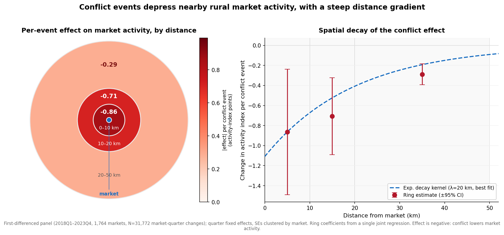
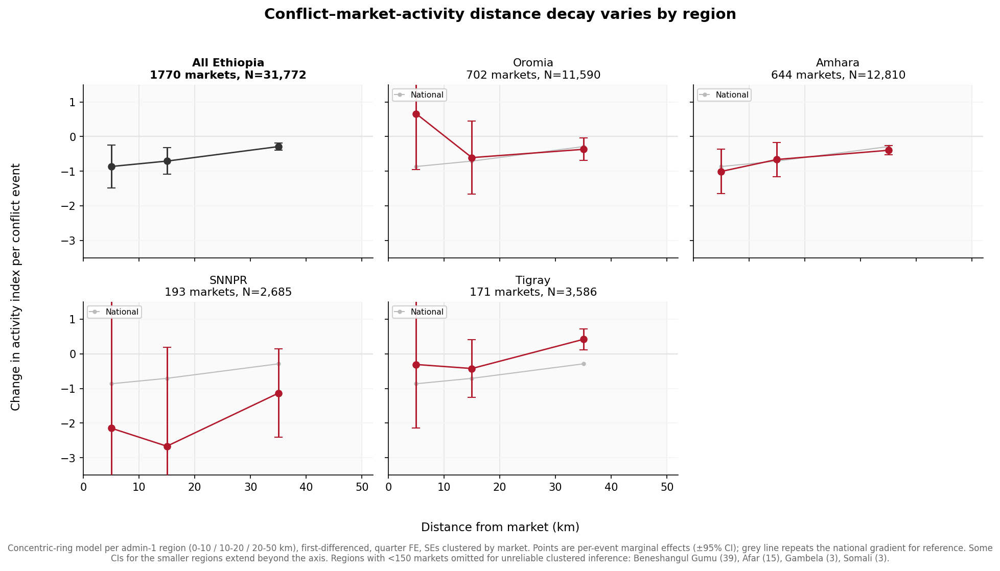
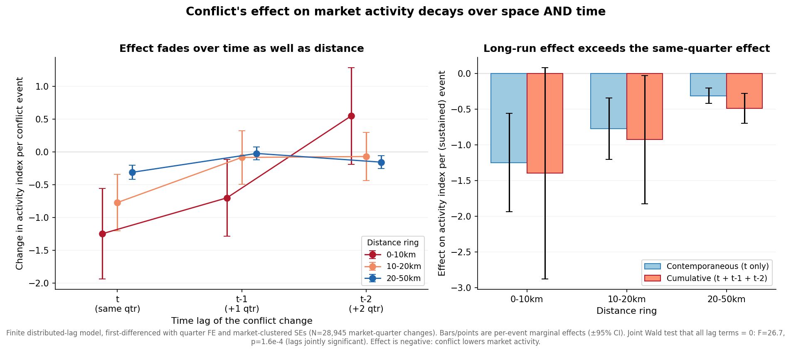
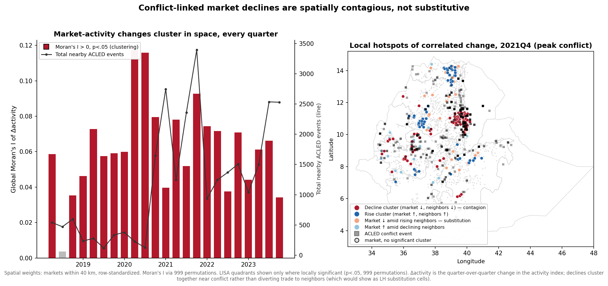
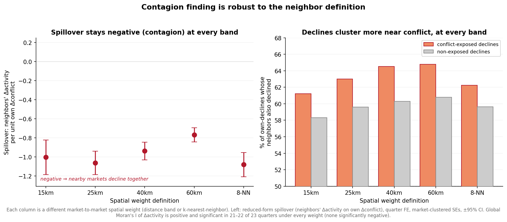
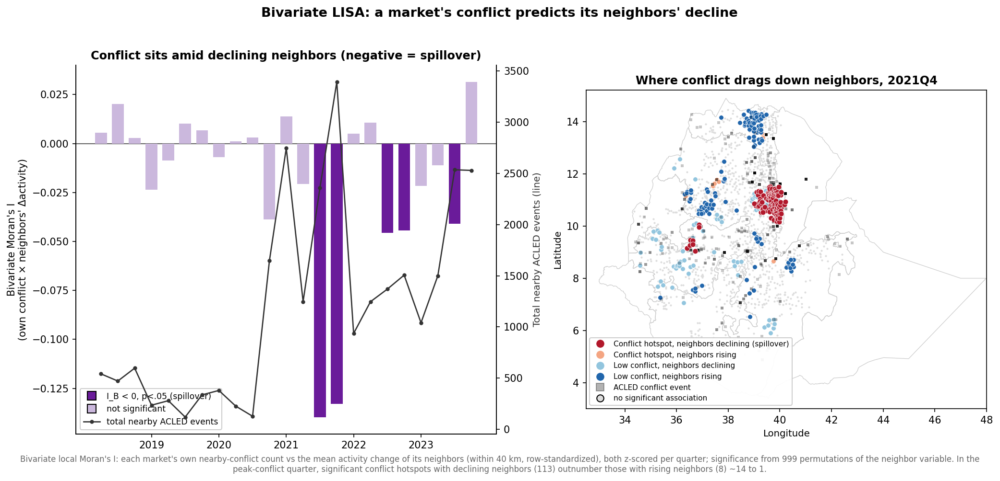

# Ethiopia Rural Market Activity Index — Interactive Map

**Live map:** https://aschroedercr.github.io/ethiopia-market-activity-map/

A time-enabled Leaflet map of 1,770 satellite-detected rural marketplaces across Ethiopia, built from the
data underlying:

> Doran, Boehnke & Krusell, *"Using satellite imagery to map rural marketplaces and monitor their activity
> at high frequency"* ([arXiv:2407.12953](https://arxiv.org/abs/2407.12953)),
> replication package: https://github.com/pauldingus/MAI-replication-package

Each market is plotted at its detected location and colored/sized by a quarterly **activity index**
(2018Q1–2023Q4), aggregated from ~2.8M per-image satellite observations down to one value per
market per quarter, restricted to images captured on the market's own trading day. An index of ~0
corresponds to a typical non-market-day baseline; ~100 corresponds to typical market-day activity for
that market in that year.

## Features

- Quarter slider with play/pause animation
- Region (admin-1) filter and boundary overlay
- Zoom-dependent hex-bin summary: zoomed out, markets are aggregated into ~25 km geographic hexagons
  colored by the mean activity index of the markets inside; zoom in past level 8 to reveal the
  individual market points. Toggleable, and respects the quarter slider and region filter. Click a hex
  for a popup with a sparkline of the bin's quarterly mean activity index over the full period
- [ACLED](https://acleddata.com/) conflict events plotted as color-coded squares for the selected
  quarter, toggleable, drawn on top of both the hexagons and the market points to visually compare
  conflict incidence against market activity
- Click any market for a popup with a sparkline of its full quarterly activity-index time series
  (highlighting the currently selected quarter) with a second series overlaid showing nearby ACLED
  conflict events per quarter (count within 20km, and fatalities), so activity dips can be checked
  against conflict spikes market by market
- Self-contained `index.html` — the aggregated data is embedded directly in the page, no server-side
  component required

## Files

- `index.html` — the map (also the GitHub Pages entry point)
- `map_template.html` — the HTML/JS template before data is embedded
- `build_ethiopia_data.py` — aggregates the raw per-image CSVs and ACLED conflict data (from the
  replication package) into `ethiopia_market_activity.json` (which also carries each market's nearby-conflict
  series), `ethiopia_conflict_events.json`, and `ethiopia_adm1.geojson`
- `build_html.py` — embeds those JSON/GeoJSON files into `map_template.html` to produce `index.html`
- `ethiopia_market_activity.json`, `ethiopia_conflict_events.json`, `ethiopia_adm1.geojson` — the
  aggregated data, also embedded in `index.html`

## Analysis: does conflict depress market activity?

A set of first-differenced panel regressions relate quarter-over-quarter changes in each market's
activity index to changes in nearby ACLED conflict. First-differencing removes each market's fixed
characteristics (baseline size/visibility); quarter fixed effects absorb nationwide shocks (weather,
seasons, sensor mix); standard errors are clustered by market. Panel: 1,764 markets × 2018Q1–2023Q4,
N = 31,772 market-quarter changes.

**Headline result:** conflict events are followed by measurable drops in nearby market activity, and the
per-event effect decays steeply with distance — an event within 10 km is associated with roughly a
−0.86-point change in the activity index (where 100 ≈ normal market-day activity) versus −0.29 at
20–50 km. The relationship is significant at every distance and the effect persists (weakly) into the
following quarter.

Scripts and outputs, in order of dependency:

- `analyze_conflict_activity.py` — the main model at a fixed 20 km catchment (pooled, + quarter FE,
  fatalities instead of counts, and a lagged-conflict spec). Writes `conflict_activity_panel.csv`, the
  assembled market-quarter panel (levels + first differences) for reuse in Stata/R.
- `radius_sensitivity.py` → `radius_sensitivity_results.csv` — re-estimates the main spec at 10 / 20 /
  50 km catchments.
- `distance_decay.py` → `distance_decay_rings.csv`, `distance_decay_results.csv` — estimates the spatial
  gradient directly: (A) concentric-ring event counts (0–10 / 10–20 / 20–50 km) in a single joint model,
  and (B) a continuous exponential-decay exposure Σ exp(−distance/λ) at λ = 5/10/20/40 km. Model fit
  (AIC) favors a decay length of ~20–40 km, so a ~20 km catchment captures most of the signal while
  staying attributable to a specific market.
- `plot_distance_decay.py` → `distance_decay.png` — the figure above.
- `plot_distance_decay_by_region.py` → `distance_decay_by_region.png`, `distance_decay_by_region.csv` —
  the same ring model re-estimated separately per admin-1 region, to compare the gradient across areas
  (see below).
- `spacetime_decay.py` → `spacetime_decay_rings.csv`, `spacetime_decay_exp.csv` — adds 1- and 2-quarter
  time lags to the ring and exponential-decay models (distributed-lag), testing whether the effect
  persists over time (see "Time lags" below).
- `plot_spacetime_decay.py` → `spacetime_decay.png` — the space × time figure.
- `spatial_autocorr.py` → `spatial_moran_by_quarter.csv`, `spatial_regressions.csv`,
  `spatial_substitution_summary.csv`, `spatial_lisa_hotspot.csv` — spatial-autocorrelation tests of
  whether conflict-linked declines cluster or substitute (see "Contagion vs substitution" below).
- `plot_spatial_autocorr.py` → `spatial_autocorr.png` — the Moran's I / LISA-hotspot figure.
- `spatial_sensitivity.py` → `spatial_sensitivity.csv`, `spatial_sensitivity.png` — re-runs the
  contagion diagnostics across neighbor bands (15/25/40/60 km) and a k-NN weight, confirming the finding
  does not depend on the 40 km choice.
- `spatial_bivariate.py` → `spatial_bivariate_by_quarter.csv`, `spatial_bivariate_hotspot.csv` — bivariate
  Moran's I / LISA pairing a market's own conflict with its neighbors' activity change, to map the
  spillover directly (see "Bivariate LISA" below). `plot_spatial_bivariate.py` → `spatial_bivariate.png`.

### Regional variation

Re-estimating the ring model region by region (each panel repeats the national gradient in grey for
reference) shows the national average masks real heterogeneity:

- **Amhara** tracks the national gradient almost exactly, with tight confidence intervals — it is the
  main driver of the countrywide result.
- **Oromia** is noisy at close range (the 0–10 km estimate is even positive but not significant) and only
  becomes precise in the 20–50 km ring.
- **SNNPR** points to a much larger near-market effect (≈ −2 to −3 points per event) but with wide CIs, so
  the magnitude is uncertain.
- **Tigray** is the clear outlier: little or no per-event effect near markets, and a *positive* 20–50 km
  coefficient. The 2018–2023 window spans the Tigray war, when conflict was near-ubiquitous and markets
  were disrupted region-wide, so a market-level event count within a small radius is a poor proxy for
  exposure there — a caution against reading the national coefficient as uniform.

Only regions with ≥150 markets are shown; Beneshangul Gumu (39), Afar (15), Gambela (3) and Somali (3)
have too few markets for reliable market-clustered inference and are omitted.

### Time lags: does the effect persist? (space × time decay)

The distance-decay model above is contemporaneous — conflict in quarter *t* vs the activity change in
*t*. To check whether conflict effects also carry forward in time, `spacetime_decay.py` extends it to a
**finite distributed-lag model in first differences**: each distance ring (and each exponential-decay
exposure) enters at lags 0, 1 and 2 quarters, keeping the quarter-FE, market-clustered design. Writes
`spacetime_decay_rings.csv` and `spacetime_decay_exp.csv`; `plot_spacetime_decay.py` →
`spacetime_decay.png`.

Findings:

- **Time lags are jointly significant** (Wald test that all six lag terms = 0: F = 26.7, p = 1.6e-4), so
  the effect is not purely contemporaneous — this validates adding the lag structure.
- **Persistence is concentrated near the market.** At 0–10 km the effect is still significant one quarter
  later (t−1 ≈ −0.70, p < 0.05); the 10–20 km ring is essentially same-quarter only. So near-market
  conflict has both the largest *and* the longest-lived footprint — decay in space and in time together.
- **The cumulative (long-run) effect exceeds the same-quarter effect** for every ring — e.g. 20–50 km:
  −0.31 contemporaneous vs −0.49 summed over three quarters — because the lag terms mostly reinforce
  rather than reverse. The long-run effect is the impact on the *level* of activity of a sustained
  conflict increase.
- **But the lags add little explanatory power** (ΔAIC = −7, R² 0.0347 → 0.0353 on N = 28,945), and the
  best-fitting spatial scale is unchanged (λ ≈ 20 km). Practically: the contemporaneous model is a good
  approximation; lags refine it (and reveal near-market persistence) without overturning the spatial
  conclusion.

### Contagion vs substitution: do declines cluster, or divert trade to neighbors?

The models above establish that conflict lowers a market's own activity. A natural follow-up: when a
market declines, do *nearby* markets also decline (spatial **contagion** / shared disruption), or do they
*rise* as trade is diverted to them (**substitution**)? `spatial_autocorr.py` tests this with the
spatial autocorrelation of the quarterly activity change (Δactivity), using a markets-within-40 km
row-standardized spatial weight.

Three converging pieces of evidence, all pointing to **contagion, not substitution**:

- **Global Moran's I of Δactivity is positive and significant in 22 of 23 quarters** (mean I ≈ +0.06,
  0 significantly negative; 999-permutation inference). Neighboring markets' changes move *together*, in
  every period — the opposite of the checkerboard pattern substitution would produce.
- **Spatial-spillover regression** (neighbors' mean Δactivity on the market's own nearby-conflict change,
  quarter FE, market-clustered SEs): coefficient −0.94 (p ≈ 1e-88). When a market's local conflict rises,
  its *neighbors'* activity falls too. A positive coefficient would have been the substitution signature;
  the sign is firmly negative. (This reduced form — own conflict predicting neighbors' outcome — sidesteps
  the simultaneity of a full spatial-lag model; a descriptive neighbor-comovement slope is +0.40 and is
  corroborated by the assumption-light Moran's I.)
- **Among market-quarters where a market itself declined**, its neighbors also declined 64.5% of the time
  when it was conflict-exposed vs 60.3% when not — declines are *more* spatially clustered near conflict.
- The **LISA hotspot map** (right, for 2021Q4, the peak-conflict quarter) shows significant local
  decline-clusters (dark red, "market ↓ amid declining neighbors") sitting directly on the dense conflict
  band in north-central Ethiopia, while substitution cells (a market falling amid rising neighbors) are
  comparatively rare (26 significant, vs 92 decline-clusters).

So conflict does not simply relocate market activity next door — it depresses whole neighborhoods of
markets together, creating spatial hotspots of decline. One visible exception on the map: parts of far-
northern Tigray show *rise*-clusters amid heavy conflict in 2021Q4, consistent with the region-specific
anomaly noted above (region-wide wartime disruption makes a small-radius conflict count a poor exposure
proxy there).

**Robustness to the neighbor definition** (`spatial_sensitivity.py`): the result does not hinge on the
40 km band. Re-running across 15 / 25 / 40 / 60 km bands and a k-nearest-neighbor (k=8) weight, the
spillover coefficient stays negative and highly significant everywhere (−0.77 to −1.08), Moran's I is
positive and significant in 21–22 of 23 quarters under every weight (never significantly negative), and
conflict-exposed declines always have more declining neighbors (61–65%) than non-exposed declines
(58–61%). The contagion reading is stable across all specifications.

Caveat specific to this test: "spillover" here cannot be cleanly separated from *shared exposure* — two
markets within 40 km of each other may both sit near the same conflict event. Both mechanisms produce
spatially clustered decline (contagion) and both are the opposite of substitution, so the qualitative
answer is robust; but the estimates should not be read as pure market-to-market transmission.

### Bivariate LISA: mapping the spillover directly

The tests above show declines cluster; a **bivariate** Moran's I / LISA (`spatial_bivariate.py`) asks the
sharper question — does a market's *own* conflict line up with its *neighbors'* activity change? It pairs
each market's nearby-conflict count (x) with the mean activity change of its neighbors (y), both z-scored
per quarter. A negative bivariate I means conflict hotspots sit amid *declining* neighbors.

- **Globally the bivariate association is weak but one-signed**: mean I_B ≈ −0.02, significantly negative
  in 5 of 23 quarters and *never* significantly positive. Crucially, the significant-negative quarters are
  concentrated in the 2021-onward conflict surge (left panel, purple bars tracking the conflict line) — the
  spillover association appears exactly when conflict is high, and is near-zero in calm periods.
- **Locally, the spillover is sharply concentrated.** In the peak-conflict quarter (2021Q4) the map shows
  113 significant "conflict hotspot, neighbors declining" cells versus just 8 "conflict hotspot, neighbors
  rising" — a ~14:1 ratio — clustered on the north-central conflict band. This is the direct spatial
  signature of conflict dragging down surrounding markets, and it complements the univariate LISA (which
  used only activity, not conflict).
- The far-northern Tigray cells classified as "low conflict, neighbors rising" are an artifact worth
  noting: ACLED coverage there was degraded during the 2021 communications blackout, understating recorded
  conflict near those markets — another reason the Tigray war years resist a simple small-radius exposure
  measure.

So the bivariate view reinforces the contagion reading — conflict is spatially tied to *neighbors'*
decline, most visibly when and where conflict is intense — while being honest that the average global
cross-association is modest.

These are associations, not causal estimates: conflict may co-move with other local disruptions
(displacement, road closures), and cloud cover can correlate with season/region in ways quarter dummies
only partly absorb.

Note: the analysis scripts read `ethiopia_market_activity.json` from this repo, but the ones that rebuild
conflict exposure by radius (`radius_sensitivity.py`, `distance_decay.py`, `spacetime_decay.py`) also need
the raw ACLED event CSV from the [MAI replication package](https://github.com/pauldingus/MAI-replication-package)
(`datasets/conflict/2012-07-01-2025-07-01-Ethiopia.csv`), expected at `../repo/` relative to the script.
ACLED data is subject to [ACLED's terms of use](https://acleddata.com/terms-of-use/) and is therefore not
redistributed here beyond the derived quarterly aggregates.

This is an independent, derived visualization — not part of the official replication package, and not
affiliated with the paper's authors.
