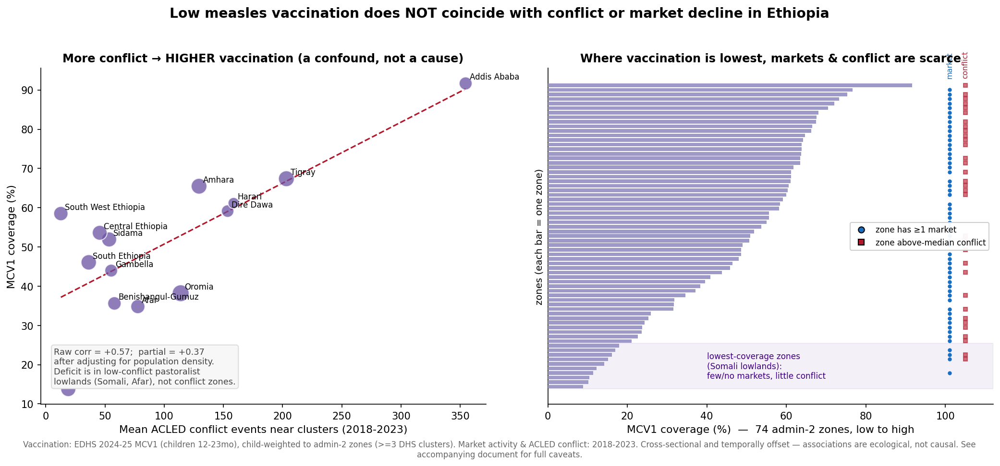
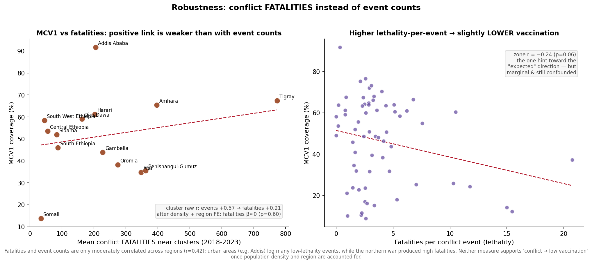

# Vaccination × conflict × market activity in Ethiopia — integration and findings

**What this is.** An integration of three independent spatial datasets for Ethiopia onto one interactive
map and a common analysis geography, to ask whether **low measles vaccination (MCV1) coincides with armed
conflict and with market-activity decline**:

1. **Market activity** — quarterly satellite-derived Market Activity Index (MAI), ~1,770 rural markets,
   2018Q1–2023Q4 ([source repo](https://github.com/pauldingus/MAI-replication-package)).
2. **Conflict** — ACLED political-violence events, 2018–2023.
3. **Vaccination** — measles first-dose (MCV1) coverage among children 12–23 months, **EDHS 2024–25**
   ([analysis repo](https://github.com/ASchroederCR/Ethiopia_Vaccination)).

**Headline finding, stated up front because it is counter-intuitive:** in this data, low vaccination does
**not** coincide with conflict or market decline — if anything the raw correlation runs the *other* way.
Ethiopia's vaccination deficit sits in the **pastoralist lowlands (Somali, Afar)**, which had comparatively
little recorded conflict in 2018–2023 and few or no monitored markets. The high-conflict northern highlands
(Tigray, Amhara) and urban centres (Addis Ababa, Dire Dawa, Harari) have **higher** vaccination. The
positive conflict–vaccination correlation is largely a **confound** (population density / urbanicity), not a
causal signal. The details, and an extended critique of what this analysis can and cannot support, follow.

---

## 1. Data provenance and independent validation ("double-checking the numbers")

The vaccination analysis in the source repo is a Quarto/R report; the underlying **DHS microdata are
access-restricted and are not redistributed here** (only zone-level aggregates are published on the map).
Because I could not take the report's outputs on trust, I **re-derived the coverage figures independently in
Python from the raw DHS Children's Recode** (fixed-width `.DAT` parsed via the CSPro `.DCF` dictionary) and
checked them against the report and the official Key Indicators Report:

| Quantity | My Python reproduction | Report / official | Match |
|---|---|---|---|
| Analysis sample (children 12–23 mo, alive, valid MCV1) | 2,295 | 2,295 | ✓ |
| DHS clusters | 722 | 722 | ✓ |
| National MCV1 (survey-weighted) | 52.2% | ~52% (official ~51%) | ✓ |
| Lowest region | Somali 17.4% | Somali ~17% | ✓ |
| Highest region | Addis Ababa 92.0% | Addis Ababa >90% | ✓ |
| Lowest admin-2 zones | Korahe 9%, Nogob 10%, Jarar 10%, Shabelle 14% (all Somali) | "Somali zones … under 10%" (names Nogob, Korahe, Jarar, Shabelle) | ✓ |

The zone-level surface I used for mapping is the report's **spatially-smoothed** (BYM2/SPDE) cluster
coverage, recovered from the rendered report and **cross-checked** against my independently-computed raw
cluster coverage (cluster-level correlation r = 0.72; the smoother sensibly pulls noisy small-sample
clusters toward their spatial neighbourhood).

## 2. Method

- **Vaccination map layer (published):** the 722 smoothed DHS clusters are child-weighted into **admin-2
  zones** (geoBoundaries ADM2, 74 zones — the same tessellation the market repo uses). Zones with **< 3 DHS
  clusters are suppressed** (shown blank) for both statistical noise and disclosure caution. 67 of 74 zones
  have a reliable estimate.
- **Association analysis:** two levels — (a) **cluster level** (n = 722), assigning each DHS cluster the
  mean market activity, market trend, and conflict-event count within 50 km (a spatial join that sidesteps
  the region-naming mismatches below); and (b) **zone level** (n = 67). Confounding by population
  density/urbanicity is tested with the DHS geographic-covariate extract.

## 3. Findings

**3.1 The intuitive hypothesis is not supported — and is reversed in the raw data.**
Conflict near a cluster correlates **positively** with its vaccination (cluster r = +0.57; zone r = +0.45,
both p < 0.001). Regional means make the mechanism obvious:

| Lowest vaccination | MCV1 | conflict (near) | | Highest vaccination | MCV1 | conflict (near) |
|---|---|---|---|---|---|---|
| Somali | 14% | 19 | | Addis Ababa | 92% | 355 |
| Afar | 35% | 78 | | Tigray | 67% | 203 |
| Benishangul-Gumuz | 36% | 58 | | Amhara | 65% | 129 |
| Oromia | 38% | 114 | | Harari | 61% | 159 |

The worst-covered regions are the **remote pastoralist lowlands** with *few* recorded conflict events and
*no* monitored markets; the best-covered are dense highland/urban areas that also record the most conflict.

**3.2 The positive link is substantially a population/urbanicity confound.**
Conflict-event counts scale with population (ACLED counts *events*, not events per capita), and vaccination
access is better where population and infrastructure are denser. Adjusting for population density, the
partial correlation of MCV1 and conflict falls from **+0.57 to +0.37** and the regression coefficient
roughly halves — but does not reverse. So urbanicity explains part, not all, of the positive association.
**It should not be read as "conflict raises vaccination";** it reflects that both conflict counts and
vaccination access rise with the highland/urban development gradient.

**3.3 Market activity has no robust association with vaccination.**
Market *presence* correlates positively with MCV1 (r = +0.45) — again because markets exist in the settled
highlands, not the low-coverage pastoralist periphery. Among areas that have markets, higher market
*activity* is weakly *negatively* correlated with MCV1 (r ≈ −0.15), and the **market-decline → low-vaccine**
signal (the policy-relevant one) is weak and **not significant after adjusting for region** (β ≈ −0.02,
p ≈ 0.12). There is no reliable evidence here that market disruption tracks vaccination.

**3.4 Fatalities instead of event counts (robustness).**
Because event *counts* conflate conflict with population/media density, I repeated everything using
conflict **fatalities** (severity). This does not rescue the naive hypothesis, and is quietly informative:

- The positive correlation is **weaker** with fatalities than events (cluster raw r = **+0.21** vs +0.57),
  exactly as expected if event counts are the more population-confounded measure.
- After adjusting for population density **and** region, the linear fatalities→MCV1 association is
  **essentially zero and non-significant** (β ≈ 0, p = 0.60) — i.e. *no* relationship either way. (A
  log-fatalities specification keeps a weak positive, p = 0.002, so the null is somewhat functional-form
  dependent; either way it is not negative.)
- Events and fatalities are only moderately correlated across regions (**r = 0.42**): urban areas log many
  low-lethality events (Addis: 355 events but ~0.6 fatalities/event — protests), while the northern war was
  high-lethality (Tigray: 203 events, ~3.8 fatalities/event).
- The **one** measure that leans the "expected" way is **fatalities per event (lethality)**: zones with more
  lethal conflict have marginally *lower* MCV1 (zone r = **−0.24, p = 0.06**). It is only marginal, at the
  zone level (n = 65), and still tracks the urban-protest vs rural-war distinction rather than a clean
  conflict effect — so it is a hypothesis to probe with better data, not a finding.

**3.5 What the map adds.** Clicking any zone shows its MCV1, market count/activity/trend, and conflict
count together. The pattern is a **spatial disjunction**: e.g. Korahe (Somali) — MCV1 9%, 0 markets, 18
conflict events; versus a Tigray zone — MCV1 68%, 50 markets, 233 conflict events.

---

## 4. Assumptions questioned (read this before using any of the above)

The user asked for transparent scrutiny. The following are reasons to treat the findings as **exploratory
and quite possibly misleading**, roughly in order of importance:

1. **Temporal mismatch — the single most serious issue.** Market activity and conflict here span
   **2018–2023**; the vaccination survey is **2024–25**. Children aged 12–23 months at that survey were born
   ~2022–2024 and received MCV1 ~2023–2025 — i.e. **after** the November 2022 Tigray peace agreement and
   after the market series ends. So the vaccination outcome is measured on a cohort vaccinated *largely
   post-conflict*. A cross-sectional 2024–25 snapshot **cannot detect** whether the 2020–22 war disrupted
   vaccination at its peak; Tigray's measured ~67% likely reflects post-war recovery and/or catch-up
   campaigns, not conditions during the fighting. **The core question — does conflict-driven market collapse
   disrupt vaccination? — is not actually answerable with these two non-overlapping time windows.** This
   analysis tests spatial *co-location today*, which is a much weaker proposition.

2. **The naive map overlay invites a false conclusion.** Simply seeing conflict squares and low-vaccination
   zones on one map tempts a "conflict → low vaccine" reading. The data show the opposite spatial pattern.
   The map is useful for *exploration*, but the visual overlay is not evidence of a relationship.

3. **Ecological inference / modifiable areal unit problem.** All associations are between *areas*, not
   people. Zone- and cluster-level correlations need not hold for individuals, and would change with a
   different zone tessellation or neighbourhood radius (I used 50 km; other choices would move the numbers).

4. **ACLED counts are not population-normalised.** Event counts conflate conflict *intensity* with
   *population and media density*. A conflict measure per capita, or fatalities per capita, or a
   displacement/access-disruption measure, could tell a different story. This is the main driver of the
   confounding in §3.2 and I have only partially adjusted for it.

5. **The vaccination outcome is a *modeled* quantity.** The zone layer aggregates the report's BYM2-smoothed
   posterior means. Using smoothed values as if they were observed data **understates uncertainty** and can
   induce spatial correlation of its own. The smoothing borrows strength across ~100 km — larger than some
   zones — so adjacent zones are not independent.

6. **DHS sampling and displacement.** (a) GPS coordinates are randomly **displaced up to 2/5/10 km**, so
   cluster-to-zone assignment misplaces some clusters near boundaries. (b) Clusters have **few children**
   (median ~3 aged 12–23 mo), so raw cluster coverage is very noisy. (c) **Eight Amhara clusters were
   dropped from the EDHS for security reasons** — precisely in a conflict-affected region — which biases the
   sample *against* observing conflict-affected populations, plausibly weakening any true conflict signal.

7. **My zone aggregation ≠ the report's zone estimates.** The report population-weights the smoothed surface
   using a WorldPop grid with posterior sampling; I used a simpler **child-count-weighted mean of smoothed
   clusters**. The two agree on the extremes (validated above) but are not identical; my zone values are not
   a substitute for the report's, and neither weights specifically by the 12–23-month population.

8. **Administrative-boundary mismatches.** Three different geographies collide: the market data's **old
   8-region** labels, the EDHS **14-region** design, and geoBoundaries' **74 admin-2 zones** (which nest in
   Ethiopia's pre-2023 structure). I joined everything by **point-in-polygon on the 74 zones** to avoid
   name-matching, but zone↔region correspondence is approximate and some zones straddle the new regional
   structure.

9. **Selection in the market layer.** Markets are detected only where periodic rural marketplaces exist —
   the agrarian highlands. Pastoralist lowlands have essentially no markets by construction, so "market
   presence" is partly a proxy for the very highland/lowland divide that drives vaccination. Comparisons
   involving markets are therefore confounded with agro-ecology.

10. **Cross-sectional, observational, correlational.** No causal claim is supported in any direction.
    Reverse causation, selection, and omitted variables (health-system investment, road access, pastoralism,
    maternal education — the last shown to matter in the source report's regression) are unaddressed.

## 5. What would actually test the intended hypothesis

- **Time-aligned vaccination data** — administrative EPI/DHIS2 monthly coverage, or WUENIC/WorldPop
  modelled annual coverage 2018–2023 — so vaccination and market/conflict cover the *same* window.
- **Zero-dose / DTP-dropout mapping** rather than a single MCV1 cross-section, to capture service breakdown.
- **Population-normalised conflict and a displacement/service-disruption measure**, not raw event counts.
- **Within-place change over time** (did vaccination fall where markets collapsed *and then* recover?),
  which is the only design that speaks to disruption, and which these two mismatched snapshots cannot.

## 6. Reproducibility and data-use notes

- `build_vax_integration.py` reproduces cluster MCV1 from DHS microdata, recovers the smoothed surface,
  spatially joins markets/conflict/vaccination, and writes the published zone layer
  (`ethiopia_zones_vax.geojson`) plus internal analysis tables.
- `analyze_vax_conflict.py` and `analyze_vax_confounder.py` produce the correlations, region table, and
  confound adjustment; `plot_vax_conflict.py` draws the figure above.
- `analyze_vax_fatalities.py` and `plot_vax_fatalities.py` produce the fatalities robustness check (§3.4)
  and its figure.
- **DHS data-use agreement:** the DHS microdata and cluster-level points are **not** included or published.
  Only **zone-level aggregates** (≥3 clusters) appear on the map and in `zone_integration_summary.csv`.
  Cluster-level intermediates stay local and are git-ignored.
- The vaccination report itself notes it was **AI-generated under general human direction and not
  comprehensively human-reviewed**; that caveat propagates into this integration.
